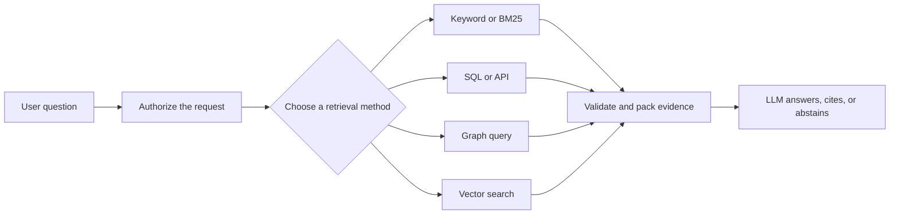

## 60-second answer

Yes. RAG requires a **retrieval step**, but it does not require a vector database.

A retriever can use BM25, full-text search, SQL, an API, a graph query, or an existing enterprise search service. The application then places the retrieved evidence in the model's context and asks the model to answer from it.

I use vector search when semantic similarity helps the workload. For example, it can connect “pay for my room” with “hotel accommodation.”

I use keyword search when exact terms matter. For example, BM25 can protect an error code such as `ERR-1047`.

For mixed questions, I may use both. I choose the design by comparing Recall@k, MRR, task success, latency, cost, freshness, and authorization behavior on the same evaluation set.

The short version is:

> RAG needs a retriever, not necessarily a vector database. The data and the evaluation should choose the retriever.

## Begin with the name

RAG stands for **retrieval-augmented generation**.

The name describes two jobs:

1. **Retrieval:** find evidence outside the model.
2. **Generation:** give that evidence to the model and produce an answer.

The name does not say how retrieval must work.

Microsoft's RAG guidance lists vector, full-text, hybrid, and manually combined searches as retrieval options.[^microsoft-retrieval] LangChain makes the same distinction in its interface: a retriever returns documents for a query and is more general than a vector store.[^langchain-retriever]



The vector branch is optional.

The retrieval branch is not.

## Separate two interview questions

Interviewers sometimes combine two different questions.

| Question | Answer | Simple example |
| --- | --- | --- |
| Can RAG work without a **dedicated vector database**? | Yes | Store embeddings in memory, in a search platform, or beside application data in a general-purpose database |
| Can RAG work without **embeddings or vectors**? | Yes | Retrieve evidence with BM25, SQL, APIs, graph traversal, or deterministic lookup |

This distinction matters.

A team may use embeddings without buying or operating a separate vector database.

A team may also build RAG without creating embeddings at all.

## Follow one real question

Suppose a support engineer asks:

> Why does `ERR-1047` send this customer back to the sign-in page?

The answer depends on three sources:

| Needed fact | Best source in this example | Why |
| --- | --- | --- |
| Meaning of `ERR-1047` | Keyword search over runbooks | The exact identifier matters |
| Customer authentication setting | SQL or application API | The value is structured and current |
| Version running in production | Deployment API | The deployment system owns this fact |

The application can follow five steps:

1. Authenticate the support engineer.
2. Search authorized runbooks for the exact error code.
3. Read the customer's current configuration.
4. Read the current deployment version.
5. Give those facts to the model with source IDs and timestamps.

```text
question
   ├── BM25 → exact error-code documentation
   ├── SQL  → authorized customer configuration
   └── API  → current deployment state
                  ↓
           evidence validation
                  ↓
          answer, cite, or abstain
```

This is RAG.

No vector database was used.

## What the code logic looks like

The important contract is not “return vectors.”

The contract is “return evidence the caller is allowed to use.”

```python
from dataclasses import dataclass
from datetime import datetime


@dataclass(frozen=True)
class Evidence:
    text: str
    source_id: str
    observed_at: datetime


def retrieve_incident_evidence(question: str, user: User) -> list[Evidence]:
    runbooks = keyword_search(
        query=question,
        allowed_groups=user.groups,
        limit=10,
    )

    customer = customer_api.get_authorized_customer(
        user=user,
        customer_id=extract_customer_id(question),
    )

    deployment = deployment_api.current_version(
        user=user,
        service=customer.auth_service,
    )

    return [
        *to_evidence(runbooks),
        to_evidence(customer),
        to_evidence(deployment),
    ]
```

The LLM receives the returned text, source identity, and freshness information.

It does not need to know whether the evidence came from BM25, SQL, or an API.

Authorization still belongs in each retrieval path. The model must never decide which customer records the user may read.

## Choose the retriever from the data

| Retrieval method | Strongest when | Example | Common weakness |
| --- | --- | --- | --- |
| **BM25 or full-text search** | Exact words, IDs, names, and rare phrases matter | `ERR-1047`, invoice number, policy title | May miss a paraphrase that uses different words |
| **SQL** | The answer depends on structured, current facts and joins | Balance, order status, inventory, entitlement | Not designed for semantic document search |
| **API** | Another system owns the authoritative live state | Deployment status, ticket state, weather | Adds latency, permissions, and failure handling |
| **Graph query** | The question follows relationships | Services affected by a failed dependency | Needs a useful graph model and query plan |
| **Vector search** | The user and document express the same meaning differently | “Room” and “hotel accommodation” | Can return semantically close but unsupported text |
| **Hybrid search** | Exact identifiers and natural-language meaning both matter | Error code plus a description of the symptom | Adds fusion, tuning, latency, and operating work |

No method is universally better.

Each one protects a different kind of signal.

## When vector search earns its place

Consider this airline question:

> Will the airline pay for my room?

The policy says:

> Hotel accommodation may be provided when an overnight stay is required and the airline caused the disruption.

Keyword search may not connect “room” with “hotel accommodation.”

Vector search can help because the phrases have similar meaning.

It still cannot prove eligibility. The system must retrieve both conditions and check the passenger's facts.

This gives us a useful rule:

- Use keyword retrieval to protect exact language.
- Use vector retrieval to recover meaning across different language.
- Use structured systems for live business facts.
- Combine them only when the evaluation shows that each branch recovers useful evidence.

## Vectors without a vector database

A small application can hold embeddings in memory and calculate cosine similarity directly.

```python
import numpy as np


def top_k(query_vector: np.ndarray, document_vectors: np.ndarray, k: int):
    query = query_vector / np.linalg.norm(query_vector)
    documents = document_vectors / np.linalg.norm(
        document_vectors,
        axis=1,
        keepdims=True,
    )
    scores = documents @ query
    return np.argsort(scores)[-k:][::-1]
```

This uses vectors.

It does not use a vector database.

The approach is useful for a small prototype or a bounded local collection. As the corpus grows, the team must handle persistence, concurrent queries, metadata filtering, updates, backups, index construction, and recovery. A vector store packages many of those jobs.

The interview point is not that in-memory search is always better.

The point is that **vector search** and **vector database** are separate decisions.

## When not to start with vectors

Start with another retrieval method when:

1. Questions contain exact error codes, invoice IDs, product names, or legal phrases.
2. The answer is a live row, calculation, or status owned by a transactional system.
3. The corpus is small enough for deterministic lookup or full-text search.
4. The organization already has a permission-aware search service that meets the quality target.
5. The request follows known relationships that a graph or SQL join expresses directly.

Do not embed a bank balance, inventory count, or payment status and hope similarity search returns the current value.

Query the system that owns the value.

## When a vector database becomes useful

A vector database becomes useful when:

1. The corpus contains large amounts of unstructured text.
2. Users frequently describe ideas with words that do not appear in the documents.
3. Exact in-memory comparison no longer meets the latency target.
4. The system needs persistent indexes, metadata filters, updates, and concurrent search.
5. The team has measured that semantic retrieval improves evidence recall.

“We have many documents” is not enough by itself.

The question is whether vector retrieval solves a measured search problem.

## How to prove the choice

Build a reviewed set of questions.

Include exact IDs, paraphrases, structured lookups, permission-denied cases, stale records, and questions with no answer.

Run each candidate design against the same set.

| What to measure | Question it answers |
| --- | --- |
| Recall@k | Did the retriever find the known evidence? |
| MRR | How early did the first relevant result appear? |
| Final task success | Did the user receive the correct outcome? |
| Correct abstention | Did the system stop when evidence was missing? |
| p95 latency | How slow were the slower requests? |
| Cost per successful answer | Did the extra retrieval stage earn its cost? |
| Freshness | Did the answer use the current source version? |
| Authorization failures | Did forbidden evidence enter candidates, context, or caches? |

A simple keyword system may beat a vector system on an exact-ID workload.

A vector system may beat keyword search on paraphrases.

A hybrid system should remain only if the combined gain is worth its complexity.

## Common interview mistakes

| Weak answer | Why it is weak | Better answer |
| --- | --- | --- |
| “RAG means storing embeddings in Pinecone.” | It turns one implementation into the definition | “RAG retrieves external evidence; Pinecone is one possible retrieval store.” |
| “Vector search is always more intelligent.” | Similarity is not truth, freshness, or authorization | “I choose search signals from the query and validate them on labeled cases.” |
| “SQL data should also be embedded.” | It can make current structured facts stale and harder to verify | “I query the authoritative system and pass the result as evidence.” |
| “No vector database means no semantic search.” | Small systems can calculate vector similarity in memory | “Vectors and vector databases are separate decisions.” |
| “We can put the whole document in the prompt.” | That skips request-time retrieval and can waste context | “For a small fixed document set, long context may be an alternative; I compare it with RAG.” |

## Likely follow-up questions

**Does RAG require embeddings?**

No. Embeddings support semantic retrieval. BM25, SQL, APIs, and graph queries can retrieve evidence without them.

**Is full-text search still RAG?**

Yes, when the application retrieves relevant external evidence for the request and supplies it to generation.

**Is putting one fixed document in every prompt RAG?**

Usually, no. That is static context injection because the application did not select evidence for the request. Terminology varies, so explain the runtime behavior instead of arguing over the label.

**Can reranking replace vector search?**

No. A reranker reorders candidates that another retriever already found. It cannot recover evidence that never entered the candidate set.

**What would you build first?**

Start with the simplest retriever that fits the data. Create a labeled baseline. Add vectors, hybrid search, or reranking only when a measured failure justifies them.

## Strong closing answer

RAG is an architectural pattern, not a database product.

The application retrieves authorized evidence, gives that evidence to the model, and asks the model to answer from it.

Sometimes BM25 is the right retriever.

Sometimes SQL or an API is the right retriever.

Sometimes vectors are necessary.

The production answer is to choose from the data, then prove the choice with evaluation.

Continue with [the production RAG pipeline](../production-rag-pipeline/), [production retrieval](../../rag/production-retrieval/), and [choosing retrieval storage](../../rag/choosing-retrieval-storage/).

[^microsoft-retrieval]: Microsoft, [“Develop a RAG solution — information-retrieval phase”](https://learn.microsoft.com/en-us/azure/architecture/ai-ml/guide/rag/rag-information-retrieval), describes vector, full-text, hybrid, and manually combined searches as retrieval options.
[^langchain-retriever]: LangChain, [“Retriever integrations”](https://docs.langchain.com/oss/python/integrations/retrievers/index), defines a retriever as an interface that returns documents for a query and states that it is more general than a vector store.
