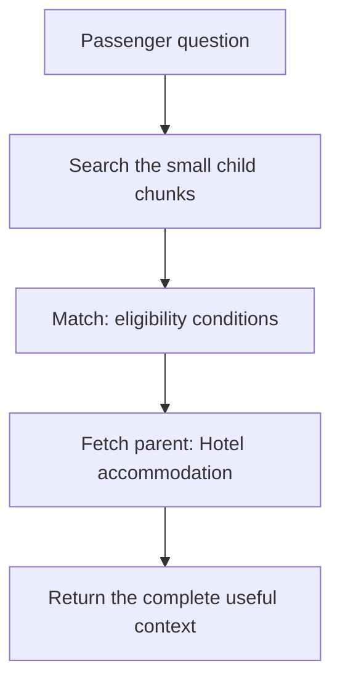
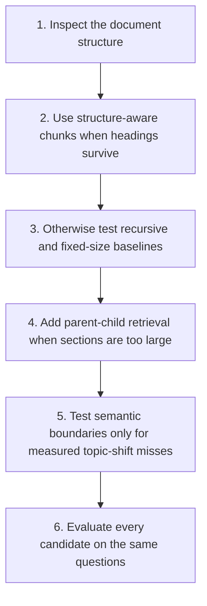

We do not usually search an entire 300-page document at once.

We break it into smaller pieces.

These pieces are called **chunks**.

But there is a problem.

If a chunk is too small, it may lose important information.

If a chunk is too large, it may contain several unrelated topics.

> **Mental model**
>
> A useful chunk can be found on its own and still preserves the meaning needed to answer.

## Begin with the answer, not a token count

Consider this fictional airline policy:

> Hotel accommodation is provided only when the disruption requires an overnight stay and the disruption was caused by the airline.

The passenger asks:

> My flight is delayed by six hours. Do I get a hotel?

The answer needs both policy conditions.

Now imagine cutting the policy here:

```text
Chunk A:
Hotel accommodation is provided when an overnight stay is required.

Chunk B:
The disruption must also have been caused by the airline.
```

Chunk A looks like a complete rule.

It is only half of the rule.

If search returns Chunk A alone, the model may give the wrong answer.

This is why there is no universal correct chunk size.

The right starting point is the **answer unit**. The answer unit is the smallest source span that contains the complete answer, including its conditions and exceptions.

## Five strategies

| Strategy | Simple explanation | Main strength | Main problem |
| --- | --- | --- | --- |
| Fixed-size | Cut after a configured number of tokens | Simple and predictable | Can cut an idea in half |
| Recursive | Try paragraphs and sentences before smaller boundaries | Preserves natural boundaries | Understands formatting, not domain meaning |
| Structure-aware | Follow headings, sections, lists, tables, or code blocks | Preserves the author's organization | Depends on parsing quality |
| Semantic | Split when a model detects a change in topic | Can preserve topic coherence | Adds cost and variability |
| Parent-child | Search a small chunk, then return a larger section | Combines precision and context | Can duplicate content and spend more tokens |

These strategies are candidates for an experiment. They are not a ranking from worst to best.

## Fixed-size chunking

Fixed-size chunking cuts text after a chosen number of tokens or characters.

```text
Chunk size: 350 tokens
Overlap: 50 tokens
```

### Why teams start here

- It is easy to implement.
- It has predictable storage and embedding cost.
- It creates a useful baseline for comparison.
- It works when the source has no reliable structure.

### What can go wrong

A fixed boundary does not know where an idea ends.

It may separate a rule from its exception. It may also separate a table header from its rows.

Overlap reduces some boundary failures. It does not understand which facts belong together.

Use fixed-size chunking as a baseline. Do not assume that it is production-ready because it is common in tutorials.

## Recursive chunking

Recursive chunking tries larger natural boundaries first.

It may try this order:

1. Paragraph break.
2. Line break.
3. Sentence boundary.
4. Space.
5. Character.

If a paragraph is small enough, the splitter keeps it.

If it is too large, the splitter tries the next separator.

LangChain's `RecursiveCharacterTextSplitter` follows this general approach.[^recursive]

### Main advantage

It usually produces more natural pieces than cutting at an exact character position.

### Main limitation

It recognizes separators.

It does not know that two paragraphs form one legal condition.

For unstructured prose, recursive chunking is a useful general baseline. For policies and manuals, compare it with structure-aware splitting.

## Structure-aware chunking

Structure-aware chunking follows the document's organization.

```text
Passenger care
  ├─ Meal vouchers
  ├─ Ground transportation
  └─ Hotel accommodation
```

The complete “Hotel accommodation” section becomes one meaningful unit.

Microsoft's chunking guidance recommends using document structure when the parser can preserve it.[^microsoft-chunking]

### Main advantage

The chunks follow how the author grouped the information.

This works well for:

- policies and contracts;
- books and manuals;
- Markdown and HTML;
- API documentation;
- source code;
- well-parsed PDFs.

### Main limitation

The strategy depends on parsing quality.

A PDF may look structured to a person while exposing no useful heading information to the parser.

A section may also be too large. In that case, preserve the section as a parent and create smaller child chunks inside it.

## Semantic chunking

Some documents change topics without headings.

Semantic chunking compares nearby sentences or paragraphs. It creates a boundary when their representations change enough.

```text
Paragraphs 1–3: hotel eligibility
Paragraphs 4–5: reimbursement limits
Paragraphs 6–8: submitting a claim
```

### Main advantage

It can find topic boundaries that formatting does not show.

### Main limitation

It adds a model-dependent step to ingestion.

The boundaries may change when the model or threshold changes. It also costs more than splitting on existing structure.

Semantic chunking is not the same as semantic search.

| Concept | When it happens | Purpose |
| --- | --- | --- |
| Semantic chunking | During ingestion | Decide where to divide a document |
| Semantic or vector search | During retrieval | Find text with related meaning |

Test semantic chunking only when the source lacks useful structure or topic boundaries are a measured problem.

## Parent-child chunking

Small chunks are easier to match precisely.

Large chunks preserve more context.

Parent-child retrieval uses both.



The system searches the smaller children.

When a child matches, it can return the larger parent section.

### Main advantage

The child improves search precision. The parent restores the surrounding rule.

### Main limitation

Several children may point to the same parent.

The context builder must remove duplicate parents. It must also avoid returning a large section when the child already contains enough evidence.

## A small structure-aware splitter

This example keeps a Markdown heading with its section body.

It is small enough to inspect.

```python title="src/examples/rag/structure_aware_chunking.py"
from dataclasses import dataclass


@dataclass(frozen=True)
class Chunk:
    section: str
    text: str
    source_id: str
    version: str
    access: str


def split_markdown_sections(
    text: str,
    *,
    source_id: str,
    version: str,
    access: str,
) -> list[Chunk]:
    chunks: list[Chunk] = []
    heading = "Document"
    body: list[str] = []

    def save_section() -> None:
        section_text = "\n".join(body).strip()
        if section_text:
            chunks.append(
                Chunk(
                    section=heading,
                    text=f"{heading}\n{section_text}",
                    source_id=source_id,
                    version=version,
                    access=access,
                )
            )

    for line in text.splitlines():
        if line.startswith("## "):
            save_section()
            heading = line.removeprefix("## ").strip()
            body = []
        else:
            body.append(line)

    save_section()
    return chunks


POLICY = """\
## Hotel accommodation

We provide a hotel only when the delay requires an overnight stay
and the disruption was caused by the airline.
"""

chunks = split_markdown_sections(
    POLICY,
    source_id="passenger-care-policy",
    version="2026-07",
    access="public",
)
for chunk in chunks:
    print(chunk)
```

The production version must also preserve tables, lists, source positions, versions, and access metadata.

Runnable copy: [`src/examples/rag/structure_aware_chunking.py`](https://github.com/ajaypv/fde101/blob/main/src/examples/rag/structure_aware_chunking.py).

## Overlap is a trade-off

Overlap repeats text on both sides of a boundary.

It can keep a condition close to the rule it qualifies.

```text
Source:
Hotel stays are covered after an overnight delay | except weather disruptions.

No overlap:
[Hotel stays are covered after an overnight delay]
[except weather disruptions]

With overlap:
[Hotel stays are covered ... except weather disruptions]
[overnight delay ... except weather disruptions]
```

Too little overlap can lose boundary information.

Too much overlap fills the result list with near-duplicates.

Prefer meaningful boundaries first. Add overlap only when the evaluation shows that it helps.

## Tune size, overlap, and retrieval depth together

| Variable | Too low | Too high |
| --- | --- | --- |
| Chunk size | Loses explanations or qualifiers | Mixes several topics |
| Overlap | Loses boundary facts | Creates duplicate results |
| Retrieved count, `k` | Misses useful evidence | Adds noise, latency, and tokens |

Changing only the chunk size can hide the real trade-off.

For example, larger chunks may improve Recall@5 while increasing token cost and reducing citation precision.

## Run a controlled experiment

Start with 30–50 representative questions.

Label the source spans that contain complete answers.

Then compare a small set of candidates:

```text
Candidate A: fixed-size, 350 tokens, 50-token overlap
Candidate B: recursive, 600 tokens, 80-token overlap
Candidate C: structure-aware parent sections with 250-token children
```

These numbers are experiment inputs. They are not universal recommendations.

Use this sequence:

1. **Freeze the source snapshot.** Use the same documents and permissions.
2. **Save the parsed representation.** Do not let parser changes look like chunking gains.
3. **Label answer-bearing spans.** Chunk IDs will change across strategies.
4. **Keep retrieval settings fixed.** Use the same query path, embedding model, and `k`.
5. **Measure retrieval.** Compare Hit@k, Recall@k, Precision@k, and duplicate rate.
6. **Read the misses.** Averages do not explain why a condition disappeared.
7. **Check the full answer.** Measure correctness, groundedness, citations, latency, index size, and re-indexing cost.

If chunking, embeddings, and reranking all change at once, the test measures the new bundle. It does not prove that chunking caused the gain.

## Choose a starting point



The diagram suggests a first experiment. The evaluation decides what ships.

## Interview answer in 30 seconds

> I choose chunking from the answer unit and the document structure. Fixed-size chunking is a useful baseline, but it can split rules from their exceptions. Recursive chunking preserves natural separators. Structure-aware chunking works well when headings, tables, or code structure survive parsing. Semantic chunking can help when topic changes are not marked, but it costs more and is less predictable. For long sections, I search small child chunks and return a larger parent when the model needs context. I compare the candidates on labeled questions while holding the corpus, query path, embedding model, and `k` constant.

Next: [search by words and meaning](./production-retrieval/) or return to the [complete RAG chapter](./).

[^microsoft-chunking]: Microsoft, [“Develop a RAG solution — chunking phase”](https://learn.microsoft.com/en-us/azure/architecture/ai-ml/guide/rag/rag-chunking-phase), recommends choosing chunking approaches from document structure and testing alternatives for the use case.
[^recursive]: LangChain, [“RecursiveCharacterTextSplitter”](https://docs.langchain.com/oss/python/integrations/splitters/recursive_text_splitter), documents the ordered-separator approach used by its recursive splitter.
