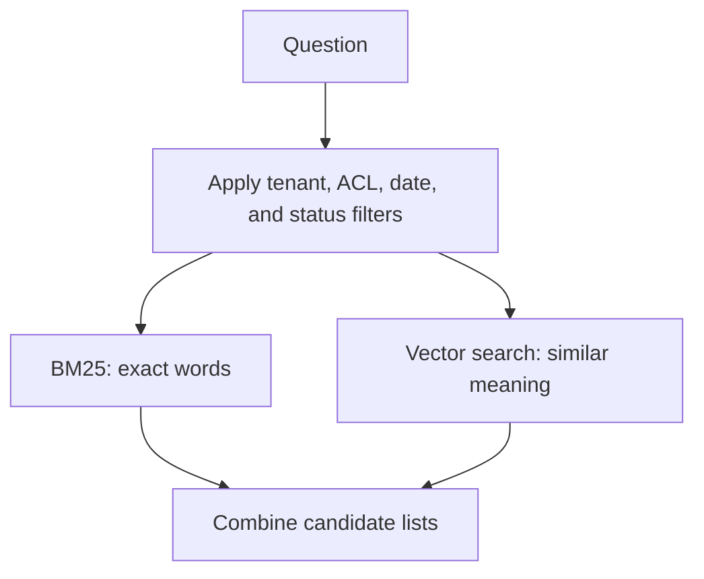
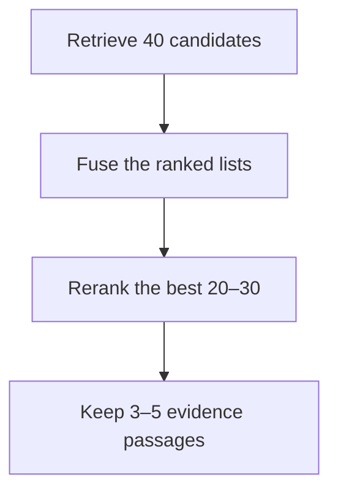

import { Code } from '@astrojs/starlight/components';
import LessonMeta from '../../../components/LessonMeta.astro';
import Takeaway from '../../../components/Takeaway.astro';
import retrievalCode from '../../../examples/rag/production_retrieval.py?raw';

<LessonMeta level="Intermediate" minutes={30} verified="16 Aug 2026" kind="Book chapter" />

<Takeaway>Retrieve broadly enough to find the evidence. Then spend more effort on a smaller candidate set.</Takeaway>

## Chapter 1: Retrieval has one job

Retrieval must place the evidence needed to answer inside the candidate set.

It does not need to answer the user.

It needs to find the passages that make an answer possible.

We will continue with the fictional airline policy:

> **IRROPS-204 — Hotel accommodation**
>
> Hotel accommodation is provided only when the disruption requires an overnight stay and the disruption was caused by the airline.

Two passengers may ask about the same policy in different ways:

```text
Query A: IRROPS-204 hotel eligibility
Query B: Will the airline pay for my room?
```

Query A contains an exact policy ID.

Query B uses a paraphrase.

One search method may not handle both equally well.

## Chapter 2: BM25 searches for words

Think of a librarian who searches the catalog for the words you used.

If you provide `IRROPS-204`, that librarian can find the exact identifier.

This is the job of keyword search.

Many search engines rank keyword results with **BM25**, commonly expanded as Best Matching 25.

### BM25 starts during ingestion

The search engine analyzes the text.

It may lowercase words, split them into tokens, remove some punctuation, or apply language-specific rules.

It then builds an inverted index.

```text
Term           Chunks containing the term
-------------------------------------------------
IRROPS-204     hotel-policy
hotel          hotel-policy, reimbursement-form
overnight      hotel-policy, overnight-operations
```

The query must use a compatible analyzer. If the index and query treat identifiers differently, exact search can fail.

### What BM25 rewards

BM25 combines three main ideas.[^bm25]

1. **Term frequency:** a matching term matters more when it appears in the passage.
2. **Document frequency:** a rare term matters more than a common term.
3. **Length normalization:** a long passage does not win only because it contains more words.

The common formula is:

```text
BM25(q, D) = Σ IDF(term) ×
             frequency × (k1 + 1)
             ──────────────────────────────────────────
             frequency + k1 × (1 - b + b × length / average_length)
```

Read it in plain language:

- `IDF` gives more weight to rare terms.
- `frequency` counts how often the term appears in the passage.
- `k1` controls how quickly repeated terms stop adding much value.
- `b` controls how strongly passage length changes the score.

The score is useful for ranking inside that search system. It is not a probability that the passage is correct.

### Airline example

`IRROPS-204` may appear in only one policy.

The word `airline` may appear in thousands of policies.

BM25 gives the rare policy ID more influence.

### Where BM25 helps

- policy IDs;
- product codes;
- error messages;
- names and acronyms;
- invoice and deployment IDs;
- exact legal phrases.

### What can go wrong

The passenger may say **room** while the document says **hotel accommodation**.

BM25 cannot reliably infer every paraphrase.

> **Mental model:** BM25 is strong when the words themselves carry the signal.

## Chapter 3: Vector search searches by meaning

Now imagine a second librarian.

This librarian does not require the same words.

The librarian recognizes that **pay for my room** is related to **hotel accommodation**.

Vector search gives us that behavior.

### How it works

1. An embedding model converts each chunk into a vector during ingestion.
2. The same compatible embedding space converts the query into a vector.
3. The vector index finds nearby document vectors.

```text
"hotel accommodation" → [0.12, -0.48, 0.73, ...]
"pay for my room"     → [0.10, -0.44, 0.70, ...]
```

The actual vectors contain many dimensions.

People do not interpret those dimensions one by one.

We use a distance or similarity function to compare them.

### What can go wrong

Vector search may find text about hotels that does not contain the eligibility rule.

It can also weaken exact identifiers.

Similarity is not truth. A collection always has a nearest vector, even when none of its passages answer the question.

Use the distance function expected by the embedding model. Use compatible query and document embeddings.

> **Mental model:** Vector search is strong when the meaning matters more than exact wording.

## Chapter 4: Hybrid search asks both

Neither librarian is always right.

So we can ask both.

This is called **hybrid search**.



For our two queries:

| Query | BM25 contribution | Vector contribution |
| --- | --- | --- |
| `IRROPS-204 hotel eligibility` | Finds the policy ID | Finds hotel-related meaning |
| `Will the airline pay for my room?` | Finds exact words such as airline and pay | Connects room with hotel accommodation |

Hybrid retrieval often improves coverage because the branches make different mistakes.[^retrieval]

It also adds work.

Ship it only when a labeled evaluation shows enough benefit.

## Chapter 5: RRF combines ranked lists

BM25 gives us one ranking.

Vector search gives us another ranking.

Their raw scores are not directly comparable.

Reciprocal Rank Fusion, or **RRF**, combines the rank positions instead.[^rrf]

```text
RRF score(document) = Σ 1 / (rank + rank constant)
```

The rank constant is commonly `60`.

It is separate from top-k.

### Worked example

| Rank | BM25 list | Vector list |
| ---: | --- | --- |
| 1 | Hotel reimbursement form | Hotel eligibility policy |
| 2 | Hotel eligibility policy | Passenger-care FAQ |

The eligibility policy receives two contributions:

```text
1 / (60 + 2) + 1 / (60 + 1)
= 1 / 62 + 1 / 61
≈ 0.03252
```

The reimbursement form appears in only one list:

```text
1 / (60 + 1)
≈ 0.01639
```

The eligibility policy wins because both retrieval branches placed it near the top.

RRF does not understand the passages. It combines ranking evidence.

## Chapter 6: Query rewriting can help or hurt

Users do not always ask clean search queries.

They may use pronouns, omit a product name, or include several questions at once.

A query rewrite can make the search request clearer.

```text
Original:
Will they pay for my room?

Possible rewrite:
airline hotel accommodation eligibility after flight disruption
```

The rewrite may improve semantic retrieval.

It may also remove an exact ID, number, or name.

Keep the original query. Use it in the keyword branch when exact text matters.

Rewriting also adds latency, cost, and another component that needs evaluation.

Test original-only, rewrite-only, and combined retrieval on the same cases.

## Chapter 7: Reranking takes a second look

Initial retrieval is designed to search a large collection quickly.

Its first ordering may be imperfect.

Suppose hybrid search returns 30 passages.

Some are useful. Others only mention hotels.

A reranker reads the question together with each candidate. It produces a more careful relevance score.

```text
question + candidate passage → reranker score
```

Cross-encoder rerankers are a common implementation. They compare the two texts jointly.[^rerank]

This costs more than the first retrieval stage.

That is why rerankers usually process tens of candidates instead of the full collection.



### What can go wrong

The reranker cannot recover a policy that retrieval never found.

A candidate pool that is too small harms recall.

A candidate pool that is too large increases latency and cost.

Measure the trade-off.

## Chapter 8: MMR reduces repetition

A reranker may return five copies of the same policy.

The copies may come from several versions, FAQs, or child chunks.

Sending all five wastes context.

Maximal Marginal Relevance, or **MMR**, balances relevance and novelty.[^mmr]

```text
MMR candidate score =
    λ × relevance to the query
    − (1 − λ) × similarity to already selected passages
```

When `λ` is higher, the selection favors relevance.

When `λ` is lower, the selection favors diversity.

### Airline example

Suppose the candidate list contains:

1. Hotel eligibility policy.
2. Duplicate hotel eligibility paragraph.
3. FAQ copy of the same rule.
4. Section explaining airline-controlled causes.
5. Reimbursement-limit section.

A pure relevance ranking may choose items 1, 2, and 3.

MMR may choose items 1, 4, and 5.

The model receives less repetition and more useful coverage.

### What can go wrong

Too much diversity can remove a second passage that is genuinely needed.

MMR does not create relevance. It only selects from the candidates it receives.

Use deduplication first when passages are exact copies. Use MMR when near-duplicate meaning is the problem.

## Chapter 9: Permissions belong inside retrieval

The user must not receive evidence they cannot access.

This rule applies to both keyword and vector branches.

```text
tenant_id = airline-support
principal_id = employee-428
acl_group_ids contains support-agents
effective_at <= request time
status = active
```

Apply authorization during search.[^access]

Filtering only after generation risks exposing private content to the model, traces, caches, or the final answer.

Test access rules with negative cases:

- another tenant's document;
- a revoked user;
- an expired policy;
- a public document and a restricted attachment;
- a cached answer created under broader permissions.

## Chapter 10: Build the final evidence package

The final passage set should be small and inspectable.

Use this order as a starting point:

1. Authenticate the caller.
2. Build tenant, ACL, freshness, and status filters.
3. Preserve the original query.
4. Create a rewrite only when it may help.
5. Run BM25 and vector search.
6. Combine results with RRF.
7. Rerank the strongest candidates.
8. Remove exact duplicates.
9. Apply MMR when near-duplicate results waste context.
10. Expand child chunks to useful parent sections.
11. Fit the evidence inside the token budget.
12. Preserve source information for citation checks.

This order is not a law.

Some systems rerank after parent expansion. Some apply diversity before a costly reranker.

Evaluate the actual pipeline as a versioned bundle.

## Provider-neutral Python

The example below preserves the original query for keyword search.

It uses a rewrite for the vector branch.

It applies access filters to both branches.

It fuses rankings with RRF and reranks only a shortlist.

<Code code={retrievalCode} lang="python" title="src/examples/rag/production_retrieval.py" />

The interfaces do not make the pipeline safe by themselves. The search adapter must enforce the filters it receives.

## Measure the retrieval stages

| Stage | Useful measure | Failure it reveals |
| --- | --- | --- |
| Keyword branch | Recall@k on exact-identifier cases | Analyzer or exact-match weakness |
| Vector branch | Recall@k on paraphrase cases | Embedding or semantic-retrieval weakness |
| HNSW index | ANN recall@k against exact search | Approximate-index loss |
| Fusion | Recall@k and rank changes | RRF helps or harms the candidate set |
| Reranking | MRR, nDCG, Recall@final-k | Correct evidence remains too low |
| MMR or deduplication | Duplicate rate and answer completeness | Context repeats or loses supporting evidence |
| End-to-end retrieval | Hit@k, Precision@k, Recall@k | Evidence reaching the context |

Do not change chunking, embeddings, fusion, and reranking together and then credit one component.

Run ablations when you need to know which component caused the change.

## Trace what happened

A useful retrieval trace records:

- original and rewritten queries;
- applied filters without secret values;
- BM25 and vector candidate IDs;
- branch ranks and RRF contributions;
- reranker model and scores;
- deduplication and MMR decisions;
- final parent and child IDs;
- latency and cost for each stage;
- index, corpus, and embedding versions.

The trace should make a failed answer explainable without reproducing the user's private data in every log.

## Interview answer in 45 seconds

> I retrieve a broad candidate set before asking the model to answer. BM25 covers exact identifiers and keyword-heavy questions. Vector search covers paraphrases. I apply the same authorization and freshness filters to both branches, combine the rankings with RRF, and use a cross-encoder or another stronger scorer to rerank a shortlist. I deduplicate results and use MMR only when repeated passages waste context. I preserve the original query because rewriting can drop exact IDs. I evaluate every stage separately, including Recall@k, MRR, ANN recall against exact search, latency, cost, and unauthorized-retrieval tests.

Next: [prepare chunks that preserve the answer](./chunking/), [understand vector indexes](./vector-search-foundations/), or [evaluate the complete answer](../evals/).

[^bm25]: Elastic, [“How full-text search works”](https://www.elastic.co/docs/solutions/search/full-text/how-full-text-works), explains the inverted index and BM25 term-frequency, document-frequency, and length signals.
[^retrieval]: Microsoft, [“Develop a RAG solution — information-retrieval phase”](https://learn.microsoft.com/en-us/azure/architecture/ai-ml/guide/rag/rag-information-retrieval), describes full-text, vector, hybrid retrieval, reranking, and evaluation choices.
[^rrf]: Microsoft, [“Hybrid search scoring — Reciprocal Rank Fusion”](https://learn.microsoft.com/en-us/azure/search/hybrid-search-ranking), documents rank-based RRF scoring for hybrid result lists.
[^rerank]: Cohere, [“Reranking with Cohere”](https://docs.cohere.com/docs/reranking-with-cohere), documents query-document reranking over a candidate list.
[^mmr]: Carbonell and Goldstein, [“The use of MMR, diversity-based reranking for reordering documents and producing summaries”](https://aclanthology.org/X98-1025/), introduced the relevance-and-novelty selection objective.
[^access]: Microsoft, [“Document-level access control”](https://learn.microsoft.com/en-us/azure/search/search-document-level-access-overview), describes permission metadata and query-time authorization filters.
