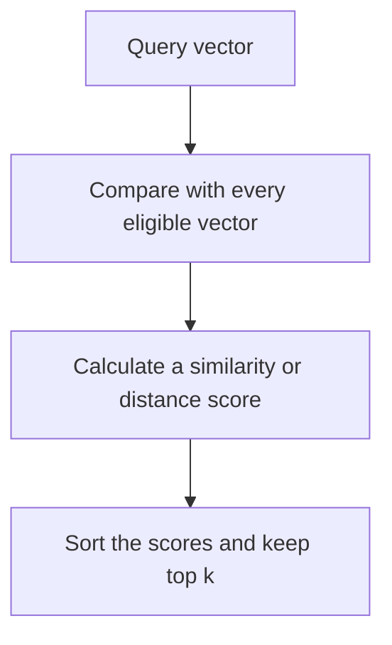
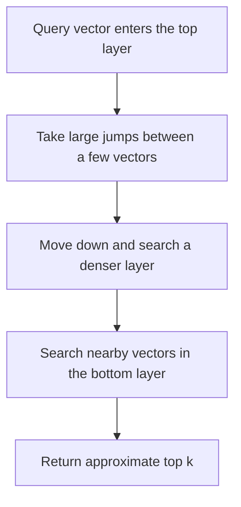

import { Code } from '@astrojs/starlight/components';
import LessonMeta from '../../../components/LessonMeta.astro';
import Takeaway from '../../../components/Takeaway.astro';
import similarityCode from '../../../examples/rag/vector_similarity.py?raw';

<LessonMeta level="Beginner" minutes={24} verified="16 Aug 2026" kind="Book chapter" />

<Takeaway>Embeddings make meaning searchable. A vector index makes that search practical at scale.</Takeaway>

## Chapter 1: Why keyword matching is not enough

Sometimes the user and the document use different words.

The passenger asks:

> Will they pay for my room?

The policy says:

> Hotel accommodation is provided only when...

The words **room** and **hotel accommodation** are different.

The meaning is similar.

A keyword search may miss that connection.

We need a way to search by meaning as well as by exact words.

## Chapter 2: What is an embedding?

An embedding represents an item as a list of numbers.

For RAG, the item is often a sentence, passage, image, or document.

```text
"hotel accommodation" → [0.12, -0.48, 0.73, ...]
"pay for my room"     → [0.10, -0.44, 0.70, ...]
```

Text with related meaning can have nearby vectors.

The model decides the representation during training.

We do not normally assign a human meaning to each individual number.

### Embedding models have a contract

The query and document vectors must live in a compatible embedding space.[^embeddings]

Use the same model and compatible query/document modes expected by that model.

Two vectors can have the same number of dimensions and still be incompatible.

Changing the embedding model usually requires re-embedding the documents.

Record the model name and version in the index metadata.

> **Mental model:** An embedding is a coordinate for similarity search. It is not a fact, label, or confidence score.

## Chapter 3: How do we compare vectors?

A distance or similarity function compares two vectors.

Common choices include:

- cosine similarity;
- dot product;
- Euclidean distance.

Use the function expected by the embedding model and database configuration.

### Cosine similarity

Cosine similarity compares the angle between two non-zero vectors.

```text
cosine similarity = dot product / (length of A × length of B)
```

For normalized vectors, cosine similarity is the same ordering as a normalized dot product.

A larger cosine score means the vectors point in a more similar direction.

It does not mean that the passage is correct.

It is not a probability.

All corpora have a nearest vector, including corpora with no answer.

Use labeled queries and abstention tests instead of treating one similarity threshold as universal.

<Code code={similarityCode} lang="python" title="src/examples/rag/vector_similarity.py" />

The `exact_search` function scores every stored vector. That makes the behavior easy to inspect.

## Chapter 4: Exact vector search

Exact k-nearest-neighbor search compares the query with every eligible vector.



### Main advantage

Exact search does not lose neighbors because of an approximate index.

It gives us the quality reference for ANN evaluation.

### Main problem

The work grows with the number of eligible vectors.

Searching a small collection may be fast enough.

Searching millions of high-dimensional vectors for many users may not be.

Filters change the cost. Hardware and database design also matter.

Do not switch to approximate search until measurements show a need.

## Chapter 5: Approximate nearest-neighbor search

Approximate nearest-neighbor search, or **ANN**, avoids checking every vector.

It searches a smaller part of the collection.

This can reduce latency.

It can also miss a vector that exact search would have returned.

That creates the central trade-off:

```text
less search work ↔ possible recall loss
```

HNSW is one widely used ANN index.

## Chapter 6: HNSW in plain language

HNSW means **Hierarchical Navigable Small World**.[^hnsw]

Think about finding an address.

You first use a motorway to move across the city.

Then you use smaller roads.

Finally, you search the local street.

HNSW uses a similar idea with vector neighborhoods.



The index contains a proximity graph.

Vectors connect to nearby vectors.

Upper layers contain fewer vectors and support larger jumps.

Lower layers contain more detail.

The search walks toward neighbors that look closer to the query.

Most stored vectors are never visited.

### What gets stored during ingestion?

We do not store a document “as HNSW.”

The database record still contains:

- chunk text;
- metadata and permissions;
- embedding vector.

The database builds an HNSW index over those vectors.

```text
Chunk record
  ├─ text
  ├─ metadata
  └─ embedding ──────┐
                     │
                     └── HNSW graph index
```

Depending on the database, the graph may be built incrementally as vectors arrive or created as an index operation.

## Chapter 7: HNSW controls

Three controls explain most first-order trade-offs.

| Setting | When it matters | Simple meaning | Cost of increasing it |
| --- | --- | --- | --- |
| `M` | Index construction and storage | Number of graph connections | More memory and larger index |
| `ef_construction` | Ingestion or index build | Effort used to place vectors well | Slower build and more compute |
| `ef_search` | Query time | Number of candidates explored | More latency and compute |

### `M`

A higher `M` gives each vector more graph connections.

More paths can improve recall.

They also increase memory use and index size.

### `ef_construction`

A higher `ef_construction` spends more work while building the graph.

This can improve index quality.

It slows ingestion or index creation.

### `ef_search`

A higher `ef_search` explores more candidates for each query.

This can improve recall.

It increases query latency.

There is no universal best setting.

Test the actual vectors, filters, hardware, and concurrency.

## Chapter 8: Filters can change the search

Production RAG rarely searches every vector.

It filters by fields such as:

- tenant;
- user permissions;
- document status;
- language;
- region;
- effective date.

Filtering and ANN search interact.

A filter may remove many of the graph neighbors that would otherwise guide the search.

Database products handle this in different ways. Some filter before vector traversal. Some filter during or after parts of the search. Some retry or increase search work.

Measure filtered recall separately from unfiltered recall.

Never relax an authorization filter to improve recall.

## Chapter 9: Measure HNSW against exact search

Use exact search to create the reference neighbor list.

Then compare HNSW with it.

```text
Exact top 5:  [A, B, C, D, E]
HNSW top 5:   [A, B, C, X, Y]

ANN recall@5 = 3 shared IDs / 5 exact IDs = 0.60
```

This metric measures index approximation.

It does not measure whether A, B, or C answers the user's question.

Keep the two recall concepts separate:

| Metric | Reference set | Question |
| --- | --- | --- |
| ANN recall@k | Exact vector top-k IDs | Did the approximate index preserve the exact neighbors? |
| RAG Recall@k | Human-labeled relevant evidence | Did retrieval find the evidence needed to answer? |

High ANN recall can reproduce a poor embedding ranking perfectly.

Low ANN recall may still retrieve the human-relevant passage by chance.

Use both metrics for different decisions.

## Chapter 10: A practical experiment

Prepare representative query vectors.

Include normal, filtered, exact-identifier, paraphrase, and no-answer cases.

Then test:

1. exact-search quality and latency;
2. HNSW recall against exact search;
3. human-labeled RAG Recall@k;
4. p50 and p95 latency;
5. memory and index size;
6. index build or update time;
7. behavior under realistic concurrency;
8. recall after tenant and ACL filters.

Try a small parameter grid.

Do not tune on one convenient query.

Record the corpus snapshot, embedding model, distance function, database version, parameters, filters, and hardware.

## Exact search or HNSW?

| Situation | Sensible first test |
| --- | --- |
| Small corpus with strict recall requirements | Exact search |
| Large corpus where exact latency misses the target | HNSW |
| Need a quality reference | Exact search |
| High query volume with acceptable measured recall loss | HNSW |
| Heavy authorization filters | Benchmark both with the real filters |
| Frequent bulk rebuilds | Include build time and memory in the decision |

pgvector supports exact search, HNSW, and IVFFlat inside PostgreSQL.[^pgvector] Other vector stores make different operational trade-offs.

The database name does not decide quality by itself.

The embedding model, filters, index settings, data distribution, and evaluation set all matter.

## Interview answer in 30 seconds

> An embedding represents text as a vector so semantically related passages can be near each other. Exact vector search scores every eligible vector and gives the reference top-k. HNSW builds a layered proximity graph and searches only a subset of vectors, which usually lowers latency but can reduce recall. During ingestion, I store the text, metadata, permissions, and vector, then build the HNSW index over the vectors. I tune `M`, `ef_construction`, and `ef_search` by measuring memory, build time, p95 latency, ANN recall against exact search, and human-labeled RAG Recall@k under the real filters.

Next: [combine vector and keyword search](./production-retrieval/) or [choose a retrieval store](./choosing-retrieval-storage/).

[^embeddings]: Cohere, [“Introduction to text embeddings”](https://docs.cohere.com/v1/docs/embeddings), documents task-specific query and document embedding input types.
[^hnsw]: Malkov and Yashunin, [“Efficient and robust approximate nearest neighbor search using Hierarchical Navigable Small World graphs”](https://arxiv.org/abs/1603.09320), introduced the layered proximity-graph method.
[^pgvector]: [pgvector](https://github.com/pgvector/pgvector) documents exact search, HNSW, IVFFlat, and the main tuning trade-offs.
